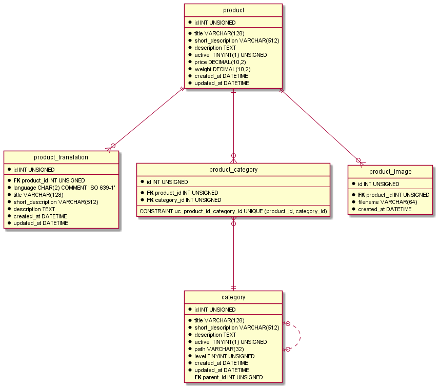

# Example implementation of REST API
Features:
- CRUD REST API endpoints for a product and product categories
- Elasticsearch for performance boost in searching
- Redis cache
- PHP 8.0

## Redis cache
Redis cache is always invalidated if some products are changed.

## Elasticsearch
Elasticsearch indexing on add/update/delete of product is triggered asynchronously.
Message is dispatched in messanger and messages are handled in defined handler.
This is useful for huge updates and there is no confidence, that ELK server is currently running.

## ER diagram for database

# Assignment
Product catalog is given, the following ** API endpoints ** must be designed:
- product listing
- product detail
- product search
- inserting and editing the product

**MySQL** is used as a DB, but each product must also be stored in **ElasticSearch**, which is
used for search.
Product listing and product detail uses **cache**, e.g. Redis.

Only at the level of ER diagram or SQL for table creation respectively needs to be developed:
- each Product belongs to exactly one Category, each Category can have *n* Products
- each Product can have *max. 3* pictures

## Description
- a concept is sufficient for successful elaboration, ie without a specific implementation of methods
- it is necessary to design controllers, services, models, etc.
- methods can be empty, only with a description of their proposed functionality
- the result must be transmitted via any GIT repository
- the use of the framework is not a condition, we are interested in code layering, SOLID principles, etc.
- for DB design, the ER diagram or SQL to create tables respectively is enough
